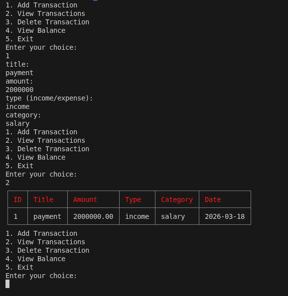

# Finance Tracker CLI

A simple personal finance tracker (ERP-lite) built in **Dart**.  
This CLI app lets you track your income, expenses, and view your balance.

## Features

- Add income and expenses
- View all transactions
- Delete transactions
- View current balance
- Categorize transactions (Food, Rent, Transport, etc.)

## Project Structure
<pre>  finance_tracker/ 
├── bin/ 
│ 
└── main.dart # Entry point (CLI) 
├── lib/ 
│ 
├── models/ # Data models (Transaction)
│ 
├── services/ # Business logic (TransactionService) 
│ 
└── utils/  # Helper functions (input helpers) 
├── pubspec.yaml  # Dart dependencies 
└── README.md  # Project overview 
 </pre>

## Installation

1. Make sure you have Dart installed:  
   [Install Dart](https://dart.dev/get-dart)

2. Clone the repository:
   ```bash
   git clone https://github.com/zloy-code/finance_tracker.git
   cd finance_tracker
   ```

3. Get dependencies:
   ```bash
   dart pub get
   ```

## Usage

Run the application:
```bash
dart run bin/main.dart
```

## Demo


## Contributing

Contributions are welcome! Feel free to submit a pull request.

## License

This project is open source and available under the MIT License.
